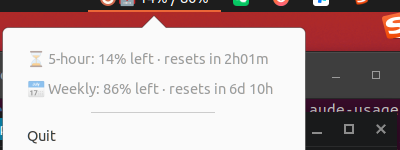

# claude-usage-indicator

A top-panel tray icon for Ubuntu/GNOME showing your [Claude Code](https://claude.com/claude-code)
account usage at a glance: percent remaining in the current 5-hour session
window, percent remaining in the weekly window, and time until each resets —
the same numbers shown in the VSCode extension's "Account & Usage" panel.



## How it works

Reads the OAuth token Claude Code already stores locally
(`~/.claude/.credentials.json`) and calls the same account-usage endpoint the
official VSCode extension uses. This endpoint is **undocumented** and has no
stability guarantee — if it ever breaks, the indicator falls back to a local
token-count estimate from [`ccusage`](https://github.com/ryoppippi/ccusage)
(if you have it installed) instead of showing nothing.

Refreshes every 3 minutes. No data leaves your machine except the request to
`api.anthropic.com` itself.

## Install

System libraries first (PyGObject/pycairo need these to build/run — pip
alone can't provide them):

```bash
sudo apt install python3-pip gir1.2-appindicator3-0.1 gir1.2-gtk-3.0 \
    libgirepository1.0-dev libcairo2-dev gobject-introspection
```

Then:

```bash
pip install --user claude-usage-indicator
claude-usage-indicator --install
```

`--install` adds an app-menu launcher ("Claude Usage"), an autostart-on-login
entry, and the tray icon. Search your app menu for "Claude Usage" to launch
it immediately, or just log out and back in.

## Uninstall

```bash
claude-usage-indicator --uninstall
pip uninstall claude-usage-indicator
```

## Proxy

A GUI-launched process doesn't inherit your shell's proxy environment
variables. If your network needs a proxy to reach `api.anthropic.com`, set
`CLAUDE_USAGE_PROXY=http://host:port` (or `HTTPS_PROXY`) in the environment
the launcher runs from — e.g. add it to the `Exec=` line's environment via
`systemctl --user edit`, or a wrapper script.

## Requirements

- Ubuntu/GNOME with AppIndicator support (`gnome-shell-extension-appindicator`,
  preinstalled and enabled on stock Ubuntu)
- Python 3.8+
- Optional: [`ccusage`](https://github.com/ryoppippi/ccusage) (via `npx`) for
  the fallback display

## Known limitations

- The account-usage endpoint is reverse-engineered, not public API — it may
  change or disappear without notice.
- Tested on GNOME Shell 3.36 (Ubuntu 20.04) with the Ayatana AppIndicator
  stack; should work on any GNOME/KDE with AppIndicator/StatusNotifierItem
  support, untested elsewhere.

## License

MIT
